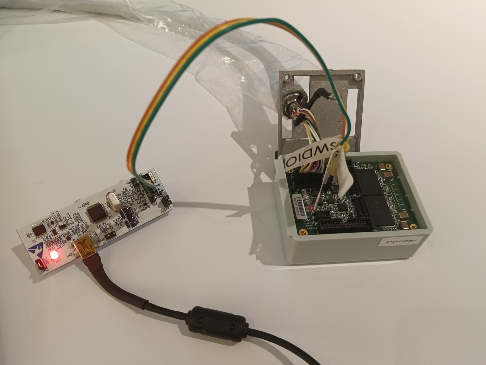

# Openwater Open-LIFU 3.2 TX Module Firmware
This repository contains the firmware for the TX Module that controls the TI TX7332 Ultrasound Analog Frontend ICs.

# Hardware
- MCU: STMicroelectronics STM32L443RCI3
- Transmitters: Two TI TX7332 ultrasound transmitter ICs
- Programming/debug interface: Both SWD through an ST-Link probe and UART through the STM32 system bootloader are supported.

References
- [STM32L443 datasheet](https://www.st.com/resource/en/datasheet/stm32l443cc.pdf): MCU pinouts and electrical limits.
- [PM0214 programming manual](https://www.alldatasheet.com/datasheet-pdf/view/700555/STMICROELECTRONICS/PM0214.html): Cortex-M4 core and SWD architecture 
- [RM0394 reference manual](https://www.rxelectronics.sg/datasheet/27/STM32L443CCT6.pdf): peripheral behaviour.
- [TI TX7332 data sheet](https://www.ti.com/lit/ds/symlink/tx7332.pdf)
- [ARM documentation sections on SWD protocol](https://support.arm.com/documentation/ihi0031/a/The-Serial-Wire-Debug-Port--SW-DP-/Introduction-to-the-ARM-Serial-Wire-Debug--SWD--protocol)

# Quickstart

Set up the hardware. The transmitter needs power and signal. Plug the transmitter into the console. Connect the ST-Link probe to the STM32L443RCI3 MCU equivalent, including pins SWCLK, GND and SWDIO on the CN4 debug connector. VDD connection is optional.

Toolchain requirements: CMake 3.22 or newer, Ninja, the complete Arm GNU Toolchain for arm-none-eabi and one flashing tool, e.g. OpenOCD, st-flash, or stm32flash

## Build

Run `cmake` to compile and then flash the preset. 

First choose a preset:

| Preset | Address | Use |
|---|---:|---|
| `ReleaseBL` | `0x08010000` | Release application for a device with the custom bootloader |
| `Release` | `0x08000000` | Standalone release; can overwrite the custom bootloader |
| `ReleaseBench` | `0x08000000` | Run [pulse sequences](SEND-PULSES.md) |
| `DebugBL` | `0x08010000` | Debug application for the custom bootloader |
| `Debug` | `0x08000000` | Standalone debug build |

List the available presets

```sh
cmake --list-presets
```

Configure and build an application for a device with the custom bootloader:

```sh
cmake --preset ReleaseBL
cmake --build --preset ReleaseBL
```

For standalone firmware, replace `ReleaseBL` with `Release`.

Each build produces:

```text
build/<preset>/lifu-transmitter-fw.elf
build/<preset>/lifu-transmitter-fw.hex
build/<preset>/lifu-transmitter-fw.bin
build/<preset>/lifu-transmitter-fw.map
```

Use the address-aware `.hex` file for normal flashing.


## Flashing
Several different CLIs are available for flashing. 

**OpenOCD over SWD (recommended)**

```sh
openocd \
    -f interface/stlink.cfg \
    -f target/stm32l4x.cfg \
    -c "init; reset halt; program build/ReleaseBL/lifu-transmitter-fw.hex verify; reset run; shutdown"
```

Flashes an application while preserving the bootloaader region. This is preferred and easy to work with since it requires minimum wiring between the st-link and the transmitter.

st-link also works in principle over SWD but needs wiring between the st-link VDD_TARGET and the transmitter 3V3 (untested)

**st-flash over SWD**

```sh
st-info --probe
st-flash --format ihex write build/ReleaseBL/lifu-transmitter-fw.hex
```

`st-flash` refuses to write if the ST-Link VDD_TARGET pin does not sense the target voltage. Connect ST-Link VDD_TARGET to target 3V3.

## Common issues

**Trying to flash over UART**
This is a separate pin from SWDIO/SWCLK/GND Using stm32flash as a CLI requires additional wiring from the ST-Link VDD_TARGET pin to the transmitter 3V3, however, the transmitter has already been powered by the console, so this path seems redundant.

stm32flash talks the ST ROM bootloader protocol "AN3155" over USART, so it requires BOOT0 asserted at reset and a USB-serial adapter wired to the module's bootloader UART pins. If you omit this, code read and erases still succeed while the write is refused, which leaves the app slot blank.

**ROM loader**
After flashing, note that a board with BOOT0 strapped high boots the ROM loader, not your image. Check where it's actually executing, a PC in 0x1FFF 0000 is system memory, i.e. the ROM bootloader:

An ST-Link may expose `/dev/cu.usbmodem*`. That port is not the transmitter bootloader UART unless the board explicitly wires it. The ST-Link also exposes `Media: microcontroller` mass-storage volume so stm32flash against it will just time out upon init. 

De-assert BOOT0 and reset to run from flash.

```sh
openocd -f interface/stlink.cfg -f target/stm32l4x.cfg -c "init; halt; reg pc; shutdown"
```

Probe the MCU

```sh
st-info --probe
st-info --probe --connect-under-reset
```

Check where the MCU is executing

```sh
openocd \
    -f interface/stlink.cfg \
    -f target/stm32l4x.cfg \
    -c "init; halt; reg pc; shutdown"
```
