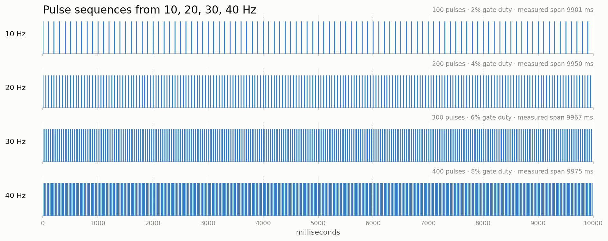

# Sending pulses

The STM32L443 microcontroller gates two TI TX7332 transmitter ICs, which drive
the transducer with a square wave at +V, 0 and −V. There is no digital-to-analog
converter in the output path, so sine output is unfortunately not possible.

The carrier is a 400 kHz square wave, from the TX7332 register profile
(`reg_values[]` in `Core/Src/demo.c`).
Gating which pulses fire and when, from in `trigger.h`:

| Parameter | Field | Default |
|---|---|---:|
| Pulse repetition frequency | `TriggerFrequencyHz` | 20 Hz |
| Pulses per train | `TriggerPulseCount` | 5 |
| Pulse width | `TriggerPulseWidthUsec` | 2000 µs |
| Trains per run | `TriggerPulseTrainCount` | 1 |
| Interval between trains | `TriggerPulseTrainInterval` | 0 µs (back-to-back) |

## Sequences tested



| Pulse repetition frequency | Pulses × trains | Gate duty | Predicted span | Measured span |
|---:|---:|---:|---:|---:|
| 10 Hz | 20 × 5 | 2% | 9900 ms | 9901 ms (~10 seconds) |
| 20 Hz | 40 × 5 | 4% | 9950 ms | 9950 ms |
| 30 Hz | 60 × 5 | 6% | 9967 ms | 9967 ms |
| 40 Hz | 80 × 5 | 8% | 9975 ms | 9975 ms |

There is no audible noise. The console is configured at 60 V (safe values
between 20 and 65 V).

## Data layers

| Layer | Owns |
|---|---|
| `uart_comms.c` | USB framing, cyclic redundancy check, status strings |
| `if_commands.c` | Interfacing | 
| `trigger.c` | `_timerDataConfig`, validation, timer setup, pulse and train counts |
| `main.c` | compile-time parameters, arm and fire, `pulse_*` symbols |

On the STM32L443, TIM1 sets the repetition rate and publishes each update as its trigger output. TIM15 is a follower timer that emits the active-low gate on channel 2 to PB15 interrupt. TIM15 shares interrupt with the TIM1 break event but is started by the hardware trigger, not by interrupt.

Addresses were checked against [RM0394](https://www.st.com/resource/en/reference_manual/dm00151940-stm32l41xxx42xxx43xxx44xxx45xxx46xxx-advanced-armbased-32bit-mcus-stmicroelectronics.pdf).

## Run the bench test

Pass every parameter explicitly, including defaults. CMake keeps earlier sweep values in its cache

```sh
cmake --preset ReleaseBench \
    -DPULSE_FREQ_HZ=20 \
    -DPULSE_DURATION_USEC=2000 \
    -DPULSE_COUNT=5 \
    -DPULSE_TRAIN_COUNT=1
cmake --build --preset ReleaseBench
```

Flash it (see [README](README.md#flashing)), then reset, run, and halt. For a longer sequence, raise the sleep past $t_{\text{span}}$ plus startup and the two-second arm delay:

```sh
printf 'reset run\nsleep 8000\nhalt\n' | nc -w 15 localhost 4444
```

Read the results:

```sh
arm-none-eabi-gdb -batch build/ReleaseBench/lifu-transmitter-fw.elf \
    -ex 'target remote localhost:3333' \
    -ex 'p/d pulse_state' \
    -ex 'p/d pulse_start_result' \
    -ex 'p/d pulse_clock_ok' \
    -ex 'p/d pulse_duration_msec'
```

| Symbol | Expected | Meaning |
|---|---:|---|
| `pulse_state` | `3` | `PULSE_COMPLETE`. `6` is `PULSE_ABORTED_OVERHEAT` — the thermal trip stopped the run partway, so ignore the span |
| `pulse_start_result` | `1` | Trigger entered `TRIGGER_STATUS_RUNNING` |
| `pulse_clock_ok` | `1` | Clock generator configuration succeeded |
| `pulse_duration_msec` | $\approx (N-1)/f$ | Arming-to-completion span. Measured from just before `start_trigger_pulse()` to the main-loop pass that observes the trigger back at `READY`, so it carries poll latency and `HAL_GetTick()`'s 1 ms quantisation — it is not a gate-to-gate measurement |
| `tx_temperature` | room temperature | Sampled once at arm time to prime the overheat interlock. `0` means that read failed and the run fired without a valid interlock reading |
